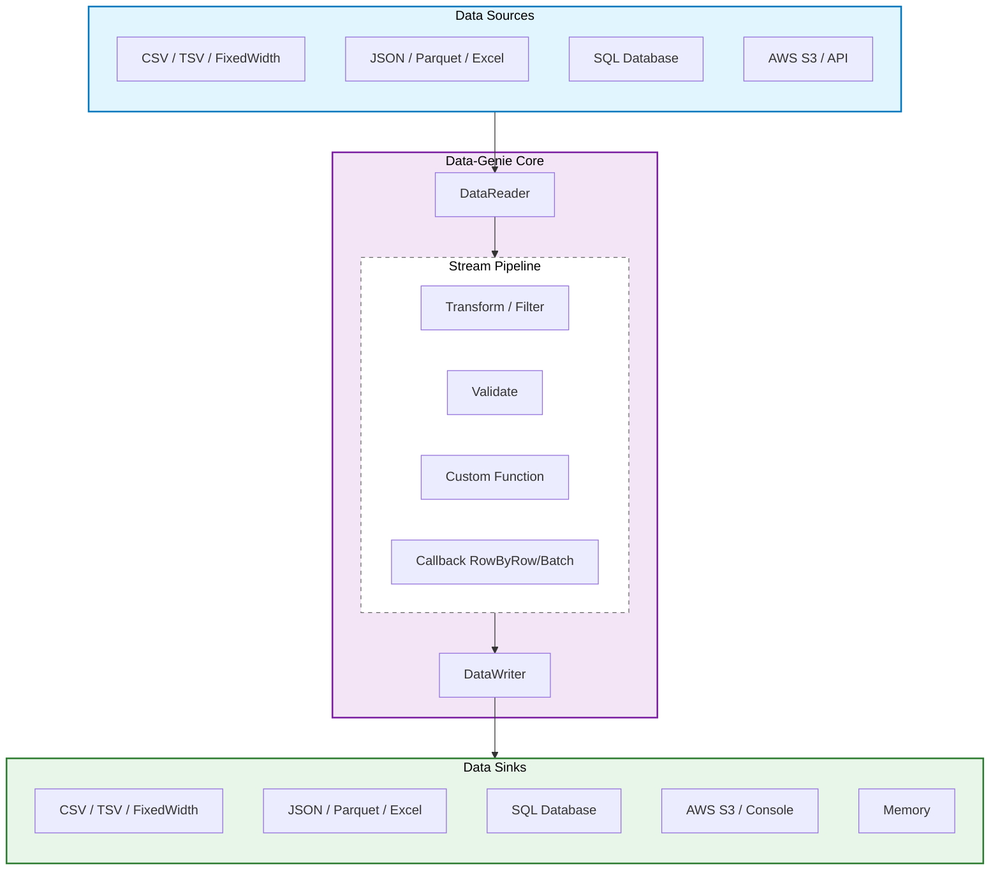

# Data-Genie 🧞‍♂️
A high-performant, streaming-first **ETL Engine** in **TypeScript**, designed for processing massive datasets with a **constant memory footprint**.

[](https://www.npmjs.com/package/@pujansrt/data-genie)
[](https://bundlephobia.com/package/@pujansrt/data-genie)
[](https://www.typescriptlang.org/)
[](https://nodejs.org/)
[](https://github.com/pujansrt/data-genie/blob/main/LICENSE)
[](https://github.com/pujansrt/data-genie)

---
## Installation

```bash
npm install @pujansrt/data-genie
```

> **Note:** `zod`, `@aws-sdk/client-s3`, and `exceljs` are optional peer dependencies in case you need them.


## Quick Start (Convert CSV to JSON in 30s)

```typescript
import { CSVReader, JsonWriter, Job } from '@pujansrt/data-genie';

const reader = new CSVReader('users.csv');
const writer = new JsonWriter('output.json');

(async () => {
    // Process 10GB+ files with just 15MB RAM
    const metrics = await Job.run(reader, writer);
    console.log(`Processed ${metrics.recordCount} records!`);
})();
```

---

## Why Data-Genie? (Performance Benchmark)

In our latest benchmarks (Processing 500k records), Data-Genie used **100x less memory** than standard array-based processing.

| Metric | Naive Approach (Load-All) | **Data-Genie (Streaming)** |
| :--- | :--- | :--- |
| **Peak Memory (RSS)** | **~396 MB** | **~3.4 MB** |
| **Stability** | Risks OOM on large files | **Constant Memory Footprint** |
| **Latency** | Waits for full read | **Starts writing immediately** |


Most ETL tools fail when processing files larger than the available RAM. Data-Genie ensures a **Constant Memory Footprint (O(1))**.

| Data Size | Naive Approach (Array-based) | **Data-Genie (Streaming)** |
| :--- | :--- | :--- |
| 100 KB | ~10 MB RAM | **~10 MB RAM** |
| 100 MB | ~150 MB RAM | **~12 MB RAM** |
| 10 GB | **CRASH (OOM)** | **~15 MB RAM** |

---

## Architecture Overview



---

## Features

- **Streaming-First:** Constant memory footprint regardless of file size (O(1) memory complexity).
- **Multi-Format:** Support for CSV, TSV, JSON, NDJSON, Parquet, Excel, and SQL.
- **Transport Agnostic:** Read/Write from Local Disk, AWS S3, HTTP APIs, or Memory.
- **Built-in Pipeline:** Filtering, Mapping, Renaming, and Zod-based Validation.
- **Fault Tolerant:** Retries, Circuit Breakers, and Dead Letter Queues (DLQ).

---

##  Advanced Usage

### 1. Data Transformation Pipeline
```typescript
let reader = new CSVReader('users.csv');

reader = new TransformingReader(reader)
    .add(new MapFields('fullName', ['fname', 'lname'], (f, l) => `${f} ${l}`).transform())
    .add(new RenameField('city', 'town').transform());

const writer = new JsonWriter('output.json');

await Job.run(reader, writer);

```

### 2. S3 Parquet to Local CSV Streaming
```typescript
const s3Client = new S3Client({ region: 'eu-west-1' });

const source = new S3Source(s3Client, 'mybucket', 'data/users.parquet');
const reader = new ParquetReader(source);
const writer = new CSVWriter('users.csv');

await Job.run(reader, writer);
```

### 3. Schema Validation (Zod)
```typescript
const reader = //...

const validator = new SchemaValidatingReader(reader, z.object({
    email: z.string().email(),
    age: z.number().min(18)
}));

const writer = //...
await Job.run(validator, writer);
```
### 4. Advanced Pipeline (Transform + Fan-out)
Read once, transform, and write to **multiple** destinations in parallel.

```ts
const pipeline = new TransformingReader(reader)
  .add((r) => ({ ...r, NAME: String(r.full_name).toUpperCase() }))
  .add(new SetCalculatedField('total', 'record.price * record.qty').transform())
  // Custom function mapping
  .add(new MapFields('summary', ['NAME', 'total'], (name, total) => `${name} spent $${total}`).transform());

const multiWriter = new MultiWriter(
  new ConsoleWriter(),
  new JsonWriter(new FileSink('processed.json'))
);

await Job.run(pipeline, multiWriter);
```

### 5. High-Performance Excel (XLSX)
```ts
// Optional: npm install exceljs
import { XlsxReader, XlsxWriter, Job } from '@pujansrt/data-genie';

const reader = new XlsxReader('large_data.xlsx'); // String path defaults to FileSource
const writer = new XlsxWriter('output.xlsx');    // String path defaults to FileSink

await Job.run(reader, writer);
```

### 6. API Ingestion (HttpSource)
```ts
import { HttpSource, JsonReader, Job } from '@pujansrt/data-genie';

const source = new HttpSource('https://api.example.com/data.json');
const reader = new JsonReader(source);

await Job.run(reader, new JsonWriter('backup.json'));
```

### 7. Custom Callbacks & Batching (RabbitMQ / DB)
Push data to external queues or perform bulk database inserts efficiently.

```typescript
// Push to RabbitMQ row-by-row
const rabbitWriter = new CallbackWriter(async (row) => {
    await queue.publish('data-events', row);
});

// Bulk insert into DB in batches of 100
const dbWriter = new BatchCallbackWriter(100, async (batch) => {
    await db.table('users').insert(batch);
});
```
---

## Contributing

Contributions are welcome! Whether it's adding a new DataReader, fixing a bug, or improving documentation.

1.  Check out our [Contributing Guide](CONTRIBUTING.md).
2.  Look for [Good First Issues](https://github.com/pujansrt/data-genie/issues?q=is%3Aopen+is%3Aissue+label%3A%22good+first+issue%22).
3.  Submit a PR!

## Running Benchmarks


Want to see the performance difference on your own machine? We provide a built-in benchmark script that compares Data-Genie with a standard `fs.readFileSync` approach.

```bash
# Clone the repo and install dependencies
git clone https://github.com/pujansrt/data-genie.git
npm install

# Run the benchmark
npx tsx benchmarks/run-benchmark.ts
```

## License
MIT © [Pujan Srivastava](https://github.com/pujansrt)

