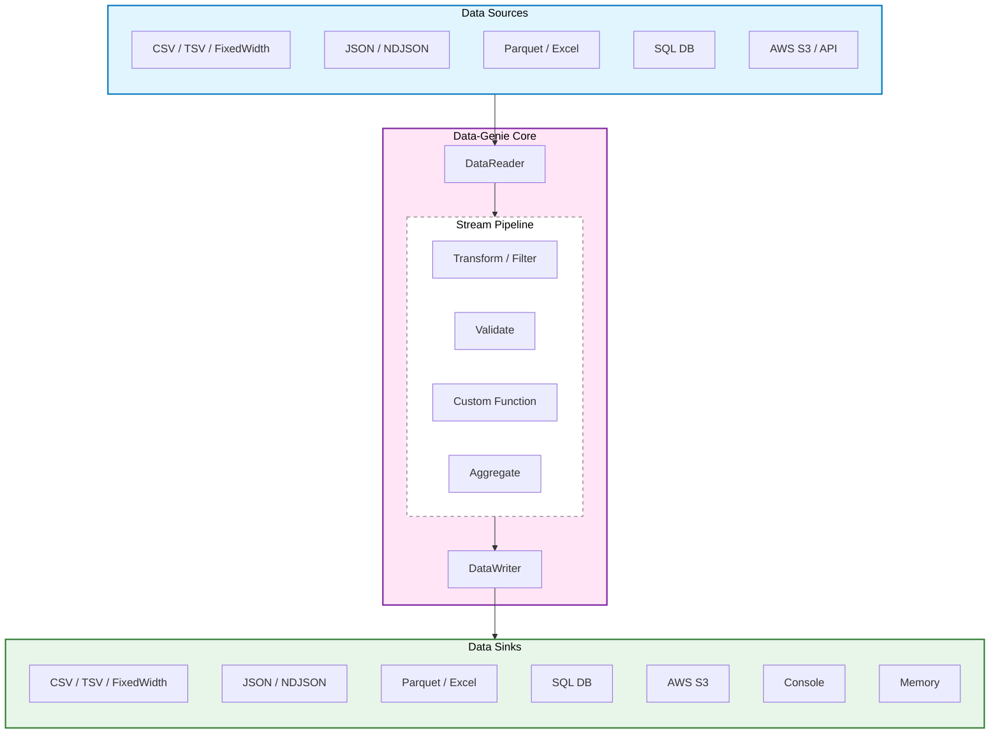

# Data-Genie
A high-performant, streaming-first **ETL Engine** in **TypeScript**, designed for reliability, scalability, and ease of use in both **TypeScript** and **Node.js** environments.

[](https://www.npmjs.com/package/@pujansrt/data-genie)
[](https://www.npmjs.com/package/@pujansrt/data-genie)
[](https://github.com/pujansrt/data-genie/actions)
[](https://bundlephobia.com/package/@pujansrt/data-genie)
[](https://www.typescriptlang.org/)
[](https://nodejs.org/)
[](https://github.com/pujansrt/data-genie/blob/main/LICENSE)
[](https://github.com/pujansrt/data-genie)



## Core Mandates

*   **Streaming-First Architecture:** Uses `AsyncIterableIterator` to ensure a constant memory footprint (~15MB), regardless of data size.
*   **Backpressure Aware:** Writers respect stream drains, preventing memory spikes during slow disk/network I/O.
*   **Schema-Driven Validation:** Integration with **Zod** for robust, contract-based data integrity.
*   **Fault Tolerance:** Built-in support for **Dead Letter Queues (DLQ)** to divert invalid records without crashing jobs.
*   **Performance Optimized:** `SQLWriter` supports configurable batch/bulk inserts to minimize network round-trips.
*   **Interface-Driven:** Decoupled architecture allowing easy extension for new Readers, Transformers, and Writers.

---

## The Streaming Advantage

Most ETL tools fail when processing files larger than the available RAM. Data-Genie ensures a **Constant Memory Footprint (O(1))**.

| Data Size | Naive Approach (Array-based) | **Data-Genie (Streaming)** |
| :--- | :--- | :--- |
| 100 KB | ~10 MB RAM | **~10 MB RAM** |
| 100 MB | ~150 MB RAM | **~12 MB RAM** |
| 10 GB | **CRASH (OOM)** | **~15 MB RAM** |

---

## Modern Architecture: Transport vs. Format

Most ETL libraries suffer from "Class Explosion" (e.g., `S3CSVReader`, `LocalCSVReader`). Data-Genie solves this by decoupling **Where the data lives (Transport)** from **How it is structured (Format)**.

### The Strategy Pattern
By separating these concerns, every Format (CSV, JSON, Parquet) automatically works with every Transport (Local, S3, HTTP, Memory).

*   **Format Readers/Writers:** Focus purely on parsing/stringifying data (CSV, JSON, Excel, Parquet).
*   **Transports (Source/Sink):** Focus purely on byte-streams (File, S3, HTTP, Memory).

---

## Installation

```bash
npm install @pujansrt/data-genie zod
```

> **Note:** `zod`, `@aws-sdk/client-s3`, and `exceljs` are optional peer dependencies.

---

## Advanced Examples

### 1. High-Performance SQL Batching & Pagination
```ts
const sqlReader = new SQLReader(dbClient, 'SELECT * FROM big_table')
  .setChunkSize(5000)       // Fetch in pages
  .setOrderBy('id');

const sqlWriter = new SQLWriter(dbClient, 'target_table')
  .setBatchSize(1000);      // Write in bulk

await Job.run(sqlReader, sqlWriter);
```

### 2. Cloud Ingestion & Sinks (AWS S3)
```ts
// Optional: npm install @aws-sdk/client-s3 @aws-sdk/lib-storage
import { S3Client } from '@aws-sdk/client-s3';
import { S3Source, S3Sink, CSVReader, JsonWriter, Job } from '@pujansrt/data-genie';

const s3Client = new S3Client({ region: 'us-east-1' });

// Decoupled Transport: Combine any Source with any Format
const source = new S3Source(s3Client, 'my-source-bucket', 'data.csv');
const reader = new CSVReader(source);

const sink = new S3Sink(s3Client, 'my-target-bucket', 'data.json');
const writer = new JsonWriter(sink);

await Job.run(reader, writer);
```

### 3. Advanced Pipeline (Transform + Fan-out)
Read once, transform, and write to **multiple** destinations in parallel.

```ts
const pipeline = new TransformingReader(reader)
  .add((r) => ({ ...r, NAME: String(r.full_name).toUpperCase() }))
  .add(new SetCalculatedField('total', 'record.price * record.qty').transform())
  // Custom function mapping
  .add(new MapFields('summary', ['NAME', 'total'], (name, total) => `${name} spent $${total}`).transform());

const multiWriter = new MultiWriter(
  new ConsoleWriter(),
  new JsonWriter(new FileSink('processed.json'))
);

await Job.run(pipeline, multiWriter);
```

### 4. High-Performance Excel (XLSX)
```ts
// Optional: npm install exceljs
import { XlsxReader, XlsxWriter, Job } from '@pujansrt/data-genie';

const reader = new XlsxReader('large_data.xlsx'); // String path defaults to FileSource
const writer = new XlsxWriter('output.xlsx');    // String path defaults to FileSink

await Job.run(reader, writer);
```

### 5. API Ingestion (HttpSource)
```ts
import { HttpSource, JsonReader, Job } from '@pujansrt/data-genie';

const source = new HttpSource('https://api.example.com/data.json');
const reader = new JsonReader(source);

await Job.run(reader, new JsonWriter('backup.json'));
```

---

## Transformers
Data-Genie provides a rich set of transformers to manipulate your data as it streams.

### Custom Field Mapping
Combine multiple fields using standard JavaScript functions.

```ts
const pipeline = new TransformingReader(new CSVReader('users.csv'))
  .add(new MapFields('fullName', ['firstname', 'lastname'], (fn, ln) => `${fn} ${ln}`).transform());
```

---

## Use Cases
- **Cloud Migration:** Moving data between S3 buckets or from S3 to SQL.
- **Data Cleaning:** Real-time transformation and schema validation.
- **Reporting:** Generating massive Excel or CSV reports from live APIs/DBs.

## License
MIT License - free for personal and commercial use.
