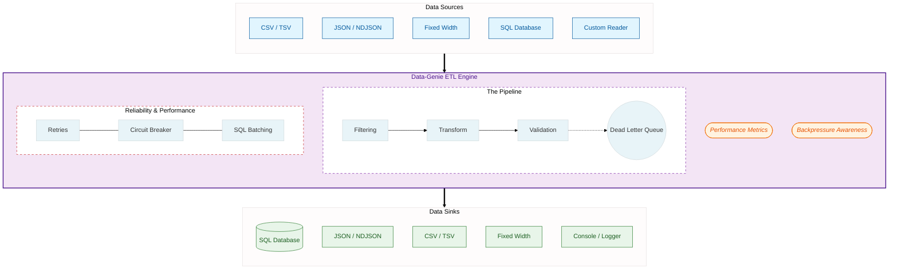

# Data-Genie
A high-performant, streaming-first **ETL Engine** in **TypeScript**, designed for reliability, scalability, and ease of use.



## Core Mandates & Best Practices

*   **Streaming-First Architecture:** Uses `AsyncIterableIterator` to ensure a constant memory footprint, regardless of data size.
*   **Backpressure Aware:** Writers respect stream drains, preventing memory spikes during slow disk/network I/O.
*   **Schema-Driven Validation:** Integration with libraries like **Zod** for robust, contract-based data integrity.
*   **Fault Tolerance:** Built-in support for **Dead Letter Queues (DLQ)** to divert invalid records without crashing jobs.
*   **Performance Optimized:** `SQLWriter` supports configurable batch/bulk inserts to minimize network round-trips.
*   **Interface-Driven:** Decoupled architecture allowing easy extension for new Readers, Transformers, and Writers.

---

## Features

- **Multi-Format Support:** Read/Write CSV, TSV, JSON, NDJSON, FixedWidth, SQL, and more.
- **Advanced Transformations:** Chainable renames, field calculations, and complex groupings.
- **Fluent Builder API:** Human-readable pipeline definitions.
- **Deduplication:** Robust record deduplication with memory-safety limits.
- **Metrics & Monitoring:** Built-in tracking for throughput, record counts, and duration.

---

## Getting Started

### Installation

```bash
npm install @pujansrt/data-genie zod
```
Zod is optional if you want to
---

## Advanced Examples

### 1. Schema Validation with Zod & DLQ
This example demonstrates how to enforce a data contract and divert "bad" records to a separate file.

```ts
import { CSVReader, JsonWriter, SchemaValidatingReader, Job } from '@pujansrt/data-genie';
import { z } from 'zod';

// Define a schema
const UserSchema = z.object({
  id: z.coerce.number(),
  email: z.string().email(),
  age: z.coerce.number().min(18)
});

async function run() {
  const reader = new CSVReader('users.csv').setFieldNamesInFirstRow(true);
  const dlqWriter = new JsonWriter('errors.json');
  
  // Wrap reader with validation
  const validatedReader = new SchemaValidatingReader(reader, UserSchema)
    .setDLQ(dlqWriter);

  const writer = new JsonWriter('clean_users.json');

  // Run job and get metrics
  const metrics = await Job.run(validatedReader, writer);
  console.log(`Throughput: ${metrics.recordsPerSecond} rec/sec`);
}
```

### 2. High-Performance SQL Batching & Pagination
Handle massive datasets by fetching in chunks and writing in bulk.

```ts
import { SQLReader, SQLWriter, Job } from '@pujansrt/data-genie';

const sqlReader = new SQLReader(dbClient, 'SELECT * FROM big_table')
  .setChunkSize(5000)       // Fetch 5000 rows at a time
  .setOrderBy('created_at') // Required for stable pagination
  .setUseTransaction(true); // Ensure a consistent snapshot

const sqlWriter = new SQLWriter(dbClient, 'target_table')
  .setBatchSize(1000)       // Buffer 1000 rows for bulk insert
  .setUseTransaction(true); // Wrap inserts in a transaction

await Job.run(sqlReader, sqlWriter);
```

### 3. Pluggable Logging
Connect your own logger (e.g., Winston, Pino) to monitor jobs.

```ts
import { Job } from '@pujansrt/data-genie';

const myLogger = {
  info: (msg) => console.log(`[CUSTOM] ${msg}`),
  warn: (msg) => console.warn(msg),
  error: (msg) => console.error(msg)
};

await Job.run(reader, writer, { logger: myLogger });
```

### 4. Resilient Writing (Retry & Circuit Breaker)
Protect your pipeline from flaky networks or database downtime.

```ts
import { SQLWriter, RetryingWriter, Job } from '@pujansrt/data-genie';

const sqlWriter = new SQLWriter(dbClient, 'users');

// Wrap the writer with retry and circuit breaker logic
const resilientWriter = new RetryingWriter(sqlWriter, {
  maxRetries: 3,
  initialDelayMs: 1000,
  circuitBreakerThreshold: 5 // Stop trying if 5 records fail in a row
});

await Job.run(reader, resilientWriter);
```

### 5. Memory-Safe Deduplication
Prevent OOM errors when deduplicating massive datasets.

```ts
import { CSVReader, RemoveDuplicatesReader, Job, ConsoleWriter } from '@pujansrt/data-genie';

const reader = new CSVReader('data.csv');
const dedupeReader = new RemoveDuplicatesReader(reader, 'email')
  .setMaxKeys(500000); // Safety limit for memory usage

await Job.run(dedupeReader, new ConsoleWriter());
```

---

## Common Workflows

### Filtering with Field Rules
Use granular rules like `IsNotNull`, `ValueMatch`, or `PatternMatch`.

```ts
import { CSVReader, FilteringReader, FieldFilter, IsNotNull, ValueMatch, Job, ConsoleWriter } from '@pujansrt/data-genie';

const reader = new CSVReader('data.csv').setFieldNamesInFirstRow(true);

const filter = new FilteringReader(reader)
  .add(new FieldFilter('Rating')
    .addRule(IsNotNull())
    .addRule(ValueMatch('A', 'B'))
    .createRecordFilter());

await Job.run(filter, new ConsoleWriter());
```

### Writing to Fixed-Width Format
Useful for legacy system integrations.

```ts
import { CSVReader, FixedWidthWriter, Job } from '@pujansrt/data-genie';

const reader = new CSVReader('data.csv').setFieldNamesInFirstRow(true);

const fwWriter = new FixedWidthWriter('output.fw')
  .setFieldNamesInFirstRow(true)
  .setFieldWidths(10, 20, 15); // Define widths for each column

await Job.run(reader, fwWriter);
```

### CSV to JSON with Field Manipulation
```ts
import { CSVReader, TransformingReader, SetCalculatedField, RemoveFields, Job, JsonWriter } from '@pujansrt/data-genie';

let reader = new CSVReader('input.csv').setFieldNamesInFirstRow(true);

reader = new TransformingReader(reader)
  .add(new SetCalculatedField('total', 'record.price * record.qty').transform())
  .add(new RemoveFields('price', 'qty').transform());

await Job.run(reader, new JsonWriter('output.json'));
```

### Filtering with Expressions
```ts
import { CSVReader, FilteringReader, FilterExpression, Job, ConsoleWriter } from '@pujansrt/data-genie';

const reader = new CSVReader('data.csv').setFieldNamesInFirstRow(true);
const filter = new FilteringReader(reader)
  .add(new FilterExpression('record.age > 21 && record.status === "active"').createRecordFilter());

await Job.run(filter, new ConsoleWriter());
```

---

## Edge Cases Handled

*   **Slow Sinks:** Using backpressure awareness, the engine pauses reading if the writer is slow.
*   **Malformed Data:** Validating readers can be configured to throw or skip/divert bad records.
*   **Large Keys:** Deduplication uses NULL-byte separators for composite keys to prevent collision and JSON-based serialization for robustness.
*   **Database Timeouts:** Bulk inserts in SQLWriter reduce transaction overhead and connection idle time.

---

## Use Cases

- **Data Cleaning:** Removing duplicates and normalizing formats.
- **Migration:** Moving data between CSV/JSON and SQL databases.
- **Validation:** Enforcing strict schemas on incoming partner data.
- **ETL Pipelines:** Building modular, testable data workflows.

## Contributing
Contributions are welcome! Please open an issue or submit a pull request.

---

## License
MIT License — free for personal and commercial use.

---

## Author
Developed and maintained by Pujan Srivastava
