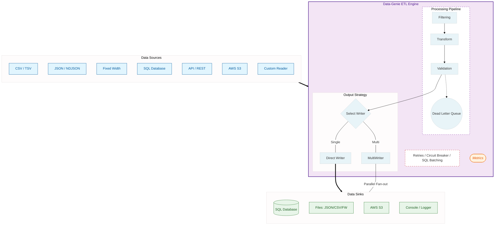

# Data-Genie
A high-performant, streaming-first **ETL Engine** in **TypeScript**, designed for reliability, scalability, and ease of use in both **TypeScript** and **Node.js** environments.

   

```mermaid
%%{init: { 'theme': 'base', 'themeVariables': { 'primaryColor': '#E8F4F8', 'actorBkg': '#D2E4F9', 'edgeLabelBackground':'#ffffff', 'noteBkgColor': '#FDF2D4', 'noteBorderColor': '#F1C40F'}}}%%

graph TD
    %% Data Sources
    subgraph Inputs [Data Sources]
        direction TB
        I1[CSV / TSV]
        I2[JSON / NDJSON]
        I3[Fixed Width]
        I4[SQL Database]
        I5[API / REST]
        I6[AWS S3]
        I7[Custom Reader]
    end

    %% The Engine Core
    subgraph Core [Data-Genie ETL Engine]
        direction TB
        
        subgraph Pipeline [Processing Pipeline]
            direction LR
            F[Filtering] --> T[Transform]
            T --> V[Validation]
            V -.-> DLQ((Dead Letter Queue))
        end

        subgraph OutputDist [Output Strategy]
            direction TB
            V --> Choice{Select Writer}
            Choice -- Single --- DW[Direct Writer]
            Choice -- Multi --- MW[MultiWriter]
        end

        Reliability[Retries / Circuit Breaker / SQL Batching]
        Metrics([Metrics])
    end

    %% Data Sinks
    subgraph Outputs [Data Sinks]
        direction TB
        O1[(SQL Database)]
        O2[Files: JSON/CSV/FW]
        O3[AWS S3]
        O4[Console / Logger]
    end

    %% Main Flow
    Inputs ==> Core
    DW ==> Outputs
    MW -- Parallel Fan-out --- Outputs

    %% Color Theme & Styling
    style Core fill:#f3e5f5,stroke:#4a148c,stroke-width:2px,color:#4a148c
    style Pipeline fill:#ffffff,stroke:#7b1fa2,stroke-dasharray: 5 5
    style Reliability fill:#ffffff,stroke:#c62828,stroke-dasharray: 5 5
    
    classDef source fill:#e1f5fe,stroke:#01579b,color:#01579b
    classDef sink fill:#e8f5e9,stroke:#2e7d32,color:#1b5e20
    classDef feature fill:#fff3e0,stroke:#ef6c00,color:#e65100,font-style:italic
    
    class I1,I2,I3,I4,I5,I6,I7 source
    class O1,O2,O3,O4,O5,O6 sink
    class Metrics,BP feature
```
