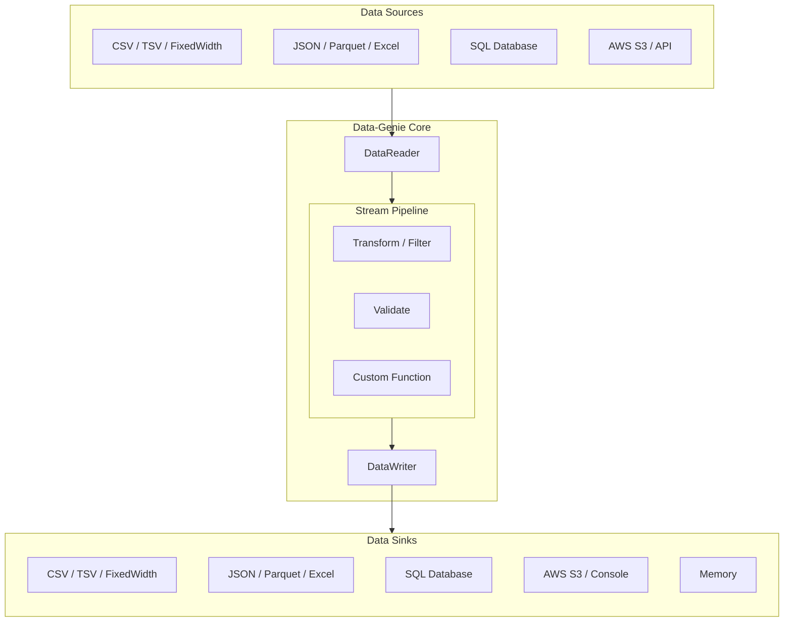

# Architecture Overview

Data-Genie is built on three core pillars: **Readers**, **Transformers**, and **Writers**, all connected by Node.js streams.

## The Pipeline Flow

## Core Components

### 1. DataReader
Responsible for fetching data from a source and parsing it into a stream of JavaScript objects (`DataRecord`).
- **FileSource**: Reads from local disk.
- **S3Source**: Streams directly from AWS S3 without downloading the whole file.
- **HttpSource**: Fetches and streams from REST APIs.

### 2. Transformers & Filters
Act as middleware in the pipeline. They receive a record, modify it (or discard it), and pass it along.
- **TransformingReader**: Apply mapping, renaming, or calculated fields.
- **FilteringReader**: Keep only records that match specific rules.
- **SchemaValidatingReader**: Ensure records match a Zod schema.

### 3. DataWriter
Takes the final objects and persists them to a destination.
- **JSON/CSV Writers**: Write to disk.
- **SQLWriter**: Bulk insert into databases.
- **CallbackWriter**: Execute custom code for every record (e.g., push to Kafka).
- **MultiWriter**: Fan-out data to multiple destinations simultaneously.

## The "Constant Memory" Secret
Unlike standard libraries that use `fs.readFileSync` or `JSON.parse` on the whole file, Data-Genie uses **Async Iterators**. Only a few records exist in memory at any given time. As soon as a record is written to the sink, it is cleared from memory, allowing you to process infinite streams.
